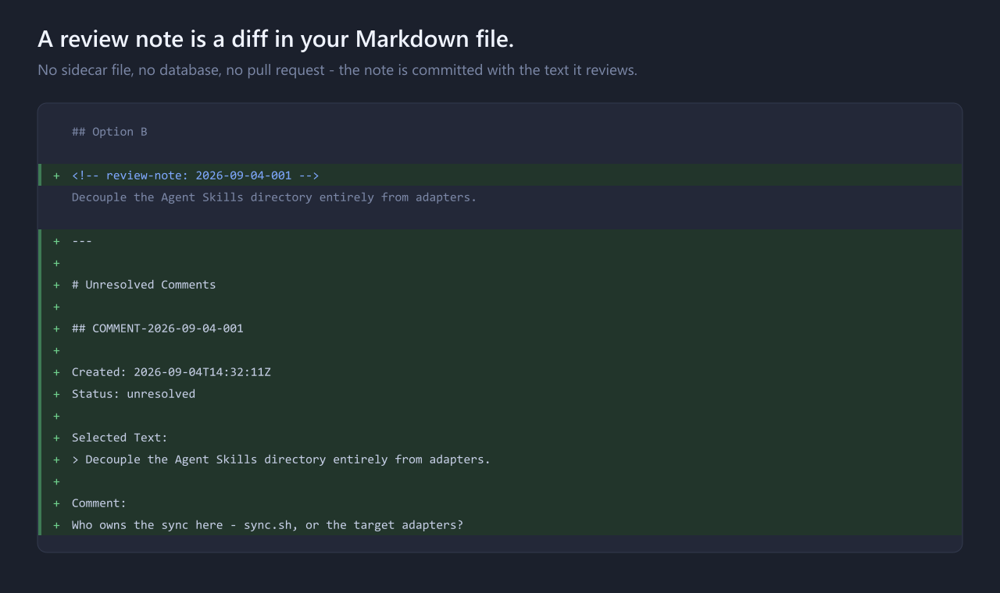
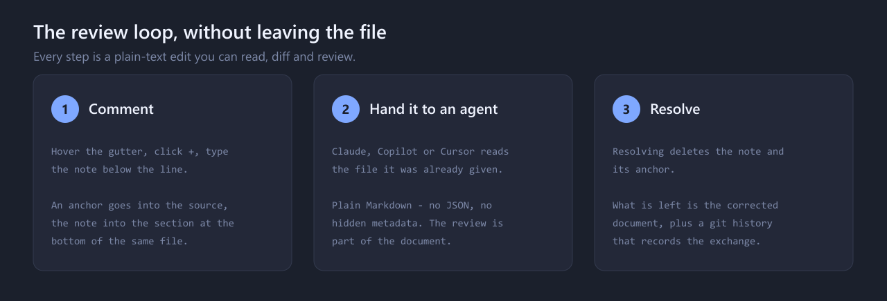

# Markdown Review Comments

**GitHub-style inline review comments that live inside your Markdown files.** Local-first,
git-native, AI-friendly — no pull request, no SaaS backend, no database.

[](https://marketplace.visualstudio.com/items?itemName=ainova-systems.markdown-review-comments)
[](https://marketplace.visualstudio.com/items?itemName=ainova-systems.markdown-review-comments)
[](https://github.com/ainova-systems/markdown-review-comments/actions/workflows/ci.yml)
[](LICENSE)

Hover the gutter of any `*.md` file, click the **+**, and type a note right below the line —
exactly like a GitHub pull-request review. The note is written into the file itself, and the
line it refers to gets an invisible anchor.



- **It is in the file.** Not a sidecar `.json`, not a database, not a comment thread on a
  server. The note is committed with the text it reviews, and it travels with the branch.
- **It survives editing.** The link to the source is an `<!-- review-note: ID -->` anchor
  that sits next to the content and moves with it — not a line number that drifts.
- **An agent can read it.** Plain Markdown, no encoding, no hidden metadata. Claude, Copilot
  or Cursor sees the review in the file you already handed it.

## Install

Search **Markdown Review Comments** in the VS Code Marketplace, or:

- Quick Open (`Ctrl+P`): `ext install ainova-systems.markdown-review-comments`
- Terminal: `code --install-extension ainova-systems.markdown-review-comments`

Then open any Markdown file, hover the gutter next to a line and click the **+**.

Requires VS Code 1.85 or newer. Editors built on it — Cursor, Windsurf, VSCodium — install it
from [Open VSX](https://open-vsx.org/extension/ainova-systems/markdown-review-comments), or
from the `.vsix` attached to any
[release](https://github.com/ainova-systems/markdown-review-comments/releases).

## How it works



### Add a comment

1. Hover the **gutter** (left of the line numbers) on the line you want to comment.
2. Click the **+** — an input box opens right below the line.
3. Type the note and click **Add review note**.

Or from the keyboard: select a line or range and press `Ctrl+Alt+M` (`Cmd+Alt+M` on macOS).
The lightbulb (`Ctrl+.`), the editor context menu and the Command Palette open the same
inline input.

Two things change in the file. An anchor is inserted above the reviewed line:

```md
## Option B

<!-- review-note: 2026-09-04-001 -->
Decouple the Agent Skills directory entirely from adapters.
```

…and the note is appended to a section at the bottom:

```md
---

# Unresolved Comments

## COMMENT-2026-09-04-001

Created: 2026-09-04T14:32:11Z
Status: unresolved

Selected Text:
> Decouple the Agent Skills directory entirely from adapters.

Comment:
Who owns the sync here — sync.sh, or the target adapters?
```

The section is created on first use and reused afterwards. Ids are deterministic and
human-readable: `COMMENT-YYYY-MM-DD-NNN`, a per-day sequence.

### Read and resolve

Saved notes come back as **native inline comment threads** anchored under the line they
reference — the same UI VS Code uses for pull-request reviews, in a plain text editor.

**Resolve removes.** Clicking **Resolve** deletes the comment block and its anchor, leaving
a clean file. There is no `Resolved:` graveyard accumulating at the bottom of your
documents; the record of the exchange is the git history. Resolve is also available from the
CodeLens above each block, from the lightbulb, and from the Command Palette.

### Hand the review to an agent

Because the notes are plain Markdown inside the document, an AI agent reads them as ordinary
context — you do not have to export anything or teach it a format.

**Export Review Context** collects every unresolved note of the current file into a fresh
document shaped for an LLM prompt: the anchor, the reviewed text, and the comment, with a
short instruction to fix the source and delete the block. Useful when you want to hand over
the review without handing over the whole file.

## Commands

From the Command Palette, category **Markdown Review Comments**:

| Command | What it does |
| --- | --- |
| `Add Unresolved Comment` | Open the inline input at the selection (`Ctrl+Alt+M`). |
| `Mark Comment Resolved` | Remove a comment block and its anchor — at the cursor, or picked from a list. |
| `Export Review Context` | Open a new document with every unresolved note, formatted for an LLM prompt. |

Navigation is offered where it is useful rather than in the palette — as a CodeLens above
each comment block (`Go to source`, `Resolve`) and above each anchored line
(`Go to comment`), and from the lightbulb inside a comment block.

## Settings

| Setting | Default | Description |
| --- | --- | --- |
| `markdownReviewComments.insertSourceMarker` | `true` | Insert the inline `<!-- review-note: ID -->` anchor above the commented line. |
| `markdownReviewComments.removeMarkerOnResolve` | `true` | Also remove the anchor when a comment is resolved. |
| `markdownReviewComments.unresolvedSectionTitle` | `Unresolved Comments` | Title of the level-1 section that groups the notes. |
| `markdownReviewComments.removeEmptySection` | `true` | Remove the section (and a preceding `---`) once the last comment is resolved. |
| `markdownReviewComments.showInlineComments` | `true` | Render saved comments as native inline threads. |
| `markdownReviewComments.enableCodeLens` | `true` | Show the `Go to source` / `Resolve` CodeLens above comment blocks. |

## Why there is no line number

A stored `Line: 42` is wrong the moment anything is inserted above it — including adding a
second comment higher up the same file. The anchor is the link instead: it physically lives
next to the content, so it moves when the content moves. The reference stays correct in the
editor, in `git diff`, and for an agent reading the raw file.

To find a note's source, search the file for its anchor core (`review-note: 2026-09-04-001`);
the `Selected Text` field is a secondary, human-readable locator. Files written by earlier
versions that still carry a `Line:` field are parsed without complaint.

## How this differs from the alternatives

Most Markdown review tools pick one of three designs. This one picks a fourth.

| Approach | Trade-off |
| --- | --- |
| **Sidecar file** (`.review.json`, `.mrsf`) | The document stays clean, but the review is invisible in `git diff`, needs the extension to be read, and goes stale when the text moves. |
| **Custom preview editor** | Comfortable to read, but you review a rendering rather than the file, and the notes live in that tool's storage. |
| **CriticMarkup / inline markup** | In the file, but it rewrites the prose itself — the document no longer renders cleanly for anyone without the tool. |
| **This extension** | Notes are ordinary Markdown in an appendix section, tied to the text by an HTML-comment anchor. The document renders normally everywhere, the review shows up in `git diff`, and any reader — human or agent — can follow it with no tooling at all. |

Nothing here talks to a network, and there are no runtime dependencies.

## Design principles

1. **Markdown is the source of truth.** Everything the extension knows is in the file.
2. **Git is the persistence layer.** No database, no sync, no account.
3. **AI readability beats machine optimisation.** If an agent cannot read it, the format is wrong.
4. **Low friction beats feature richness.** One keystroke to comment, one click to resolve.

### Non-goals

This is not a GitHub review replacement, a collaborative SaaS, a live multi-user tool, an
issue tracker, a Markdown CMS, or a WYSIWYG editor. It is a lightweight, Markdown-native way
to capture review notes locally.

## Development

```bash
npm install
npm run compile      # one-off build (strict tsc)
npm run watch        # incremental build
npm test             # unit tests for the Markdown engine (node:test)
npm run verify       # the full gate: compile + test
```

Press <kbd>F5</kbd> to launch the **Extension Development Host**; it opens the bundled
[`examples/`](examples/) folder, which contains a short walkthrough to practise on.

```text
src/
  extension.ts                     # activation + command/provider registration
  providers/
    ReviewCodeActionProvider.ts    # lightbulb / Ctrl+. actions
    ReviewCommentController.ts     # Comments API: gutter +, inline input, inline threads
  services/
    MarkdownService.ts             # pure Markdown engine (ids, parse, insert, remove)
    CommentService.ts              # add / resolve / export orchestration (WorkspaceEdit)
    NavigationService.ts           # CodeLens + go-to-source
  models/ReviewComment.ts          # domain type
  test/markdownService.test.ts     # unit tests for the engine
```

`MarkdownService` deliberately has no `vscode` dependency, so the whole parsing and
formatting core is unit-testable in plain Node. See [AGENTS.md](AGENTS.md) for the working
agreement and [CONTRIBUTING.md](CONTRIBUTING.md) before opening a PR.

## Contributing, security, licence

- Bugs and ideas: [open an issue](https://github.com/ainova-systems/markdown-review-comments/issues).
- Vulnerabilities: see [SECURITY.md](SECURITY.md) — please report privately.
- Releases: [CHANGELOG.md](CHANGELOG.md); the process is in [docs/releasing.md](docs/releasing.md).
- Licence: MIT — see [LICENSE](LICENSE).

## Built AI-first

Markdown Review Comments was designed and implemented by AI coding agents, end to end — a
working proof of [AI-First engineering](https://www.ainovasystems.com), not a claim about it.

Created by **Dmitrij Zykovic** — Fractional CTO at [Ainova Systems](https://www.ainovasystems.com).
Helping teams adopt AI automation, establish an AI-First SDLC, and build fully autonomous AI
engineering pipelines.

[LinkedIn](https://www.linkedin.com/in/dmitrijz/) · [Advisory & Consulting](https://www.ainovasystems.com) · [Sandbox Console](https://marketplace.visualstudio.com/items?itemName=ainova-systems.sandbox-console), the sibling extension
